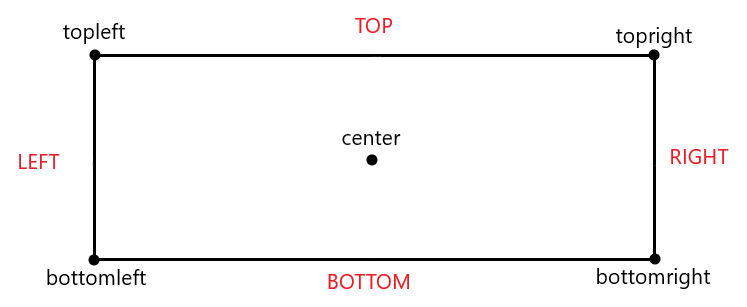
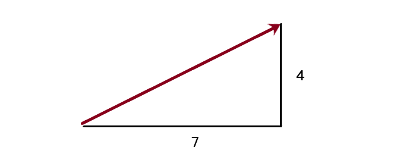

# C3 - Les rectangles

Un rectangle est un ensemble de points et de coordonnées pouvant être relié à une surface. Dans ce chapitre, nous apprendrons à créer et utiliser un rectangle

## 1 - Création et points

### Créer un rectangle à partir d'une surface

Il est possible de créer un rectangle à partir d'une surface avec la méthode `get_rect(coord)`, sachant que `coord` représente la position du rectangle par un tuple de coordonnées $(x, y)$. En reprenant la voiture du chapitre précèdent:

```python
voiture = pygame.image.load("dossier_images/taxi.png").convert_alpha()

voiture_rect = voiture.get_rect((screen_width / 2, screen_height / 2))
```

De cette manière, on obtient un rectangle qui possède _les même dimensions_ que la surface associée (içi `voiture`).

### Positionner une image à partir d'un rectangle

Ce qu'il serait idéal de faire est de positionner `voiture` selon `voiture_rect`. Pour cela, au lieu de spécifier un tuple de coordonnées dans la méthodes `blit`, on donne le rectangle créé.

```python
screen.blit(voiture, voiture_rect)
```

`voiture` sera ainsi positionné selon l'argument passé à la méthode `get_rect` (dans le cas précédent, les coordonnées sont screen_width / 2 et screen_height / 2).

!!!info
    Il est plus pratique de positionner un élément selon un rectangle qui possède les même dimensions plutôt que des valeurs numériques constantes puisque ce rectangle est une variable et peut être ainsi modifié. Signifiant en d'autres termes qu'un rectangle nous permettra de déplacer des surfaces facilement et avec précision.

### Positionner avec précision

Comme nous l'avons dit auparavant, les surfaces sont positionnées par rapport à leur coin supérieur gauche. Or nous pouvons positionner notre rectangle à partir de 5 points différents:

- topleft : le coin supérieur gauche (par défaut)
- topright : le coin supérieur droit
- bottomleft : le coin inférieur gauche
- bottomright : le coin inférieur droit
- center : le point central

Nous pouvons visualiser un rectangle ainsi :



On spécifie le point selon lequel le rectangle est positionné à l'initialisation de celui-ci:

```python
haut_gauche = voiture.get_rect(topleft=(0, 0))
haut_droit = voiture.get_rect(topright=(screen_width, 0))
bas_gauche = voiture.get_rect(bottomleft=(0, screen_height))
bas_droit = voiture.get_rect(bottomright=(screen_width, screen_height))
au_centre = voiture.get_rect(center=(screen_width / 2, screen_height / 2))
```

Pour traduire ce que nous avons écrit, nous créons cinq rectangles. On place le coin supérieur gauche du premier au point `(0, 0)`. On place le coin supérieur droit du second au point `(screen_width, 0)`. On place le coin inférieur gauche du troisième au poit `(0, screen_height)`. On place le coin inférieur droit du quatrième au point `(screen_width, screen_height)`. Enfin, on place le point central du dernier au centre de l'écran. Nous pouvons ainsi essayer d'afficher la surface `voiture` à ces différentes coordonnées:

```python
screen.blit(voiture, haut_gauche)
screen.blit(voiture, haut_droit)
screen.blit(voiture, bas_gauche)
screen.blit(voiture, bas_droit)
screen.blit(voiture, au_centre)
```

## 2 - Modifier la position d'un rectangle

### Accéder aux points du rectangle

Il est possible d'accéder à la valeur des cinq points vus auparavant d'un rectangle. Ces points font partie de ses attributs :

```python
print(au_centre.center)
print(au_centre.topleft)
print(au_centre.topright)
print(au_centre.bottomleft)
print(au_centre.bottomright)
```

Cependant, ces différents points sont une combinaison de deux coordonnées. Or, il est également possible d'accéder à ces coordonnées individuellement :

```python
print(au_centre.left) # Peut être simplifié par au_centre.x
print(au_centre.top) # Peut être simplifié par au_centre.y
print(au_centre.right)
print(au_centre.bottom)
print(au_centre.centerx)
print(au_centre.center)
```

### Déplacer un rectangle : coordonnée

L'avantage de ces coordonnées est qu'elles peuvent êtres **modifiées** comme bon nous semble. Elles fonctionnent comme des variables normales auquelles nous pouvons affecter une nouvelle valeur. Ainsi, nous pouvons déplacer notre voiture vers le haut en décrémentant de manière continue la valeur y de son rectangle :

```python
running = True
background = pygame.image.load("dossier_images/background.png").convert_alpha()
voiture = pygame.image.load("dossier_images/taxi.png").convert_alpha()
voiture_rect = voiture.get_rect(center=(screen_width / 2, screen_height))

while running:
    # Boucle évènementielle içi
    screen.blit(background, (0, 0))
    screen.blit(voiture, voiture_rect)
    voiture_rect.y -= 1
    # Update et tick ici
```

Petit problème, notre voiture finit par sortir de l'écran. En effet la coordonnée $y$ est constamment décrémentée, cette valeur finit ainsi par être négative. On peut remédier à cela grâce à une condition `if`. En effet, SI le bas du rectangle dépasse le haut de l'écran (le coordonnée bottom < 0), alors on replace le haut du rectangle en bas de l'écran (coordonnée top => screen_height) :

```python
running = True
background = pygame.image.load("dossier_images/background.png").convert_alpha()
voiture = pygame.image.load("dossier_images/taxi.png").convert_alpha()
voiture_rect = voiture.get_rect(center=(screen_width / 2, screen_height))

while running:
    # Boucle évènementielle içi
    screen.blit(background, (0, 0))
    screen.blit(voiture, voiture_rect)
    voiture_rect.y -= 1
    if voiture_rect.bottom < 0:
        voiture_rect.y = screen_height 
    # Update et tick ici
```

Nous pouvons évidemment rendre notre voiture plus rapide en décrémentant la coordonnée y avec une valeur plus élevée que 1:

```python
running = True
background = pygame.image.load("dossier_images/background.png").convert_alpha()
voiture = pygame.image.load("dossier_images/taxi.png").convert_alpha()
voiture_rect = voiture.get_rect(center=(screen_width / 2, screen_height))
vitesse = 4

while running:
    # Boucle évènementielle içi
    screen.blit(background, (0, 0))
    screen.blit(voiture, voiture_rect)
    voiture_rect.y -= vitesse
    if voiture_rect.bottom < 0:
        voiture_rect.y = screen_height 
    # Update et tick ici
```

!!!Exercice
    === "Enoncé"
        Supposons que nous souhaitons que notre voiture roule dans l'autre sens (vers le bas). Commencez par retourner la surface `voiture` en lui faisant subir une rotation. Utilisez un rectangle et faites-attention à ce que sa coordonnée y évolue correctement. Lorsque la voiture sortira de l'écran, elle devra encore une fois revenir à son point de départ (en haut de l'écran cette fois-çi).
    === "Correction"
        ```python
        running = True
        background = pygame.image.load("dossier_images/background.png").convert_alpha()
        voiture = pygame.image.load("dossier_images/taxi.png").convert_alpha()
        voiture = pygame.transform.rotate(voiture, 180)
        voiture_rect = voiture.get_rect(center=(screen_width / 2, screen_height))
        vitesse = 4

        while running:
            # Boucle évènementielle içi
            screen.blit(background, (0, 0))
            screen.blit(voiture, voiture_rect)
            voiture_rect.y += vitesse
            if voiture_rect.top > screen_height:
                voiture_rect.bottom = 0
            # Update, tick et méthodes blit ici
        ```


### Déplacer un rectangle : point

Il est également possible de déplacer un rectangle à partir de l'un de ses 5 points (topleft, bottomright, etc). Pour cela, il est plus convenable d'utiliser un **vecteur** à deux dimensions. L'objet `Vector2` se situe dans le module _math_ de Pygame :

```python
vecteur_voiture = pygame.math.Vector2(x, y)
```

$x$ et $y$ représentent respectivement la distance $x$ et $y$ parcourue par le vecteur. Par exemple voiçi une représentation possible du vecteur $(7, 4)$ :



Il est ainsi possible d'appliquer un vecteur sur l'un des points d'un rectangle. Par exemple, en supposant un rectangle `voiture_rect`, le code çi-dessous:

```python
vecteur_voiture = pygame.math.Vector2(1, 2)

while running:
    # Boucle évènementielle
    voiture_rect.center += vecteur_voiture
    # Update, tick et méthodes blit
```

Equivaut plus ou moins à :

```python
vitesse_x = 1
vitesse_y = 2

while running:
    # Boucle évènementielle
    voiture_rect.centerx += vitesse_x
    voiture_rect.centery += vitesse_y
    # Update, tick et méthodes blit
```

Remarquons qu'utiliser un vecteur est plus court à écrire. De plus, les vecteurs possèdent certaines méthodes qui pourraient peut-être nous être utiles. Par exemple, vous pouvez facilement obtenir la longueur (la norme) de votre vecteur grâce à la méthode `length`. Tout comme vous pouvez rotater votre vecteur avec la méthode `rotate`.

Nous pouvons facilement modifier les distances $x$ et $y$ d'un vecteur (qui influencent le déplacement du rectangle). Ainsi, en supposant qu'on veuille que notre voiture se déplace en "L":

```python
def swap_values(vector: pygame.math.Vector2):
    vector.x, vector.y = vector.y, vector.x

SPEED = 5
voiture_rect = voiture.get_rect(bottomleft=(0, screen_height))
voiture_rect.centerx = screen_width / 2
vecteur_voiture = pygame.math.Vector2(0, SPEED)

while running:
    # Boucle évènementielle
    if voiture_rect.bottom > screen_height:
        voiture_rect.bottom = screen_height
        vecteur_voiture.y = -SPEED
    if voiture_rect.left < 0:
        voiture_rect.left = 0
        vecteur_voiture.x = SPEED
    if voiture_rect.centerx > screen_width / 2 or voiture_rect.centery < screen_height / 2:
        swap_values(vecteur_voiture)
        voiture_rect.center = (screen_width / 2, screen_height / 2) 
    voiture_rect.topleft += vecteur_voiture
    # Blit, update et tick
```

Dans le morceau de code précèdent, on écrit une fonction `swap_values` qui prend en argument un vecteur et échange les valeurs $x$ et $y$ de ce vecteur.

!!!Note
    Il faut bien noter l'importance des signes (positif ou négatif) à l'égard des valeurs $x$ et $y$ d'un vecteur. Si $x$ est positif, le rectangle se déplace vers la droite. Si $x$ est négatif, le rectangle se déplace vers la gauche. Dans le cas où $x$ est nul, le rectangle ne se déplace plus sur l'axe $x$ (horizontalement). 

!!!Warning
    Ne jamais oublier que le point $0$ est situé sur le bord supérieur de l'écran ! Ainsi, si $y$ est positif, le rectangle se déplace vers le bas et non vers le haut. Si $y$ est négatif, le rectangle se déplace vers le haut. Dans le cas où $y$ est nul, le rectangle ne se déplace plus sur l'axe $y$ (verticalement).

## 3 - Collisions

### Colliderect

Un des autres aspects pratiques des rectangles est que l'on peut facilement vérifier si une collision a lieu entre deux rectangles grâce à la méthode `colliderect(rectangle)`. En prenant [cette image](images/Car.png), nous pouvons essayer de simuler un accident. Mais avant cela, nous allons mettre à l'épreuve les connaissances acquises :


!!!Exercice
    === "Enoncé"
        Votre mission, si vous l'acceptez, est tout d'abord d'afficher la voiture orange (**Car.png**) et le taxi (**taxi.png**). Ces deux images devront posséder leur propre rectangle et doivent _obligatoirement_ finir par se superposer (comme vu dans la vidéo çi-dessus). Les deux voitures devront être centrées horizontalement. Le taxi doit être vers le bas de l'écran et la voiture orange vers le haut de l'écran. Faites bien attention à ce que la voiture orange soit tournée afin de faire face au bas de l'écran. Les deux voitures doivent se déplacer à une vitesse de 4 pixels par itération. 
    === "Correction"
        ```python
        taxi = pygame.image.load("dossier_images/taxi.png").convert_alpha()
        taxi_rect = taxi.get_rect(center=(screen_width / 2, screen_height - 50))

        voiture_orange = pygame.image.load("dossier_images/Car.png").convert_alpha()
        voiture_orange = pygame.transform.rotate(voiture_orange, 180)
        orange_rect = voiture_orange.get_rect(center=(screen_width / 2, 50))
        while running:
            # Boucle évènementielle
            taxi_rect.y -= 4
            orange_rect.y += 4
            screen.blit(background, (0, 0))
            screen.blit(voiture_orange, orange_rect)
            screen.blit(taxi, taxi_rect)
            # Upadate et tick
        ```

Quand les deux voitures entrent en collision l'une avec l'autre, aucune ne subit de dégât. Or, ceçi est contre les lois de la physique ! Non ! Les deux voitures devraient **exploser** lorsque la collision a lieu. Prenons cette [image](images/explosion.png) et mettons la méthode `colliderect` en action !

La syntaxe pour `colliderect` est:

```python
rectangle1.colliderect(rectangle2)
```

Et cette méthode renvoie une valeur booléene qui vaut True si une collision a lieu entre `rectangle1` et `rectangle2`, ou False dans le cas contraire. Il ne nous reste plus qu'a modifier les images stockées dans les variables `voiture_orange` et `taxi` si la collision a lieu:

```python
taxi = pygame.image.load("dossier_images/taxi.png").convert_alpha()
taxi_rect = taxi.get_rect(center=(screen_width / 2, screen_height - 50))

voiture_orange = pygame.image.load("dossier_images/Car.png").convert_alpha()
voiture_orange = pygame.transform.rotate(voiture_orange, 180)
orange_rect = voiture_orange.get_rect(center=(screen_width / 2, 50))

intact = True
while running:
    # Boucle évènementielle
    if taxi_rect.colliderect(orange_rect):
        intact = False
        taxi = voiture_orange = pygame.image.load("dossier_images/explosion.png").convert_alpha()
    if intact:
        taxi_rect.y -= 4
        orange_rect.y += 4
    screen.blit(background, (0, 0))
    screen.blit(voiture_orange, orange_rect)
    screen.blit(taxi, taxi_rect)
    # Upadate et tick
```

Qui donne comme résultat final :


### Collidepoint

Parfois, ce n'est pas une collision entre deux rectangles qu'on souhaite tester mais une collision entre un rectangle et un point $(x, y)$. Ce sera notamment le cas quand on souhaitera plus tard tester si il y une collision entre le curseur et un rectangle. Pour cela, nous utilisons la méthode `collidepoint(point)` associée au rectangle. A titre d'exemple, supposons que le point $(0, 0)$ mène à la destruction certaine de la voiture orange créée plus tôt (en conservant la position que nous lui avons donné). Et que notre voiture orange finit justement par atteindre ce point en se déplacant continuellement vers la gauche :

```python
while runnning:
    # Boucle évènementielle
    if orange_rect.collidepoint((0, 0)):
        voiture_orange = pygame.image.load("dossier_images/explosion.png").convert_alpha()
    else:
        orange_rect.x -= 5
```

## Conclusion

Nous venons d'aborder l'une des parties les plus importantes de Pygame. Les rectangles, qui s'obtiennent généralement à partir d'une surface grâce à la méthode `get_rect`. Nous pouvons repositionner un rectangle à tout moment en affectant une nouvelle valeur à l'un de ses points (topleft, center, bottomright, etc) ou à l'une de ses coordonnées individuelles (right, top, centery, etc). Les rectangles sont parfois accompagnés d'un vecteur `Vector2` si il doit effectuer des déplacements d'une certaine compléxité. Nous pouvons facilement tester une collision entre deux rectangles grâce à la méthode `colliderect`. Cependant, toujours aucun moyen d'interagir avec les éléments de l'écran ! Sans interactions, ce que nous construisons n'est pas un jeu vidéo mais juste une vidéo. Nous remédierons à cela dans le [prochain chapitre](C4-Interactions.md).

