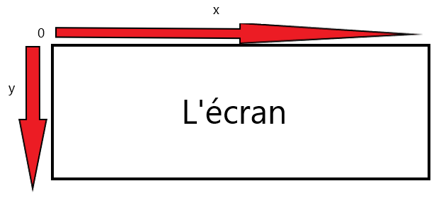

# C4 - Du contenu pour l'écran

Jusque-là, nous avons pu créer un écran noir possédant les dimensions souhaitées. Mais un jeu vidéo, ce n'est pas qu'un écran noir ! Dans ce chapitre, nous apprendrons à embeillir notre écran avec des images et des couleurs.

## 1 - Définir un arrière-plan pour notre jeu

### Remplir avec une couleur

La première option d'arrière-plan est une couleur. Pour cela, nous pouvons la méthode `fill(couleur)` associée à notre écran. Par exemple, pour obtenir un arrière-plan rouge, on peut écrire dans la boucle principale :

```python
screen.fill("red")
```

!!!Warning
    Nous ne préciserons pas toujours si une instruction doit être incluse dans la boucle principale ou non. Dans la boucle principale, on écrit le code qui constitue le _déroulement_ et les mécaniques du jeu, donc ce qui doit continuellement être répété ou mis à jour. Avant cette boucle, on écrit les instructions qui devront être exécutées avant le jeu en lui-même, ce qui inclut régulièrement l'initialisation des variables et la définition des fonctions.

L'affichage des images et des couleurs doit être constamment mis à jour (nous verrons pourquoi plus bas), ce pourquoi ce type d'instruction doit être écrit à l'intérieur de la boucle principale.

### Définir une image comme arrière-plan

L'autre option est de prendre une image pour l'arrière-plan. Nous ne pouvons pas directement utiliser des images à partir de leur chemin d'accès. Nous devons d'aborder créer une **surface** associée à l'image. Dans Pygame, une surface est tout objet à deux dimensions pouvant être perçu par le joueur. L'écran que nous avons créé est lui-même une surface par exemple, les textes et les images en sont aussi une. Afin de créer une surface à partir d'un chemin d'accès à une image, nous pouvons utiliser la fonction `load` du module image :

```python
background = pygame.image.load("dossier_images/background.png")
```

Nous initialisons ici une variable. Il serait donc préférable d'écrire la ligne çi-dessus AVANT la boucle principale. Nous obtenons ainsi une surface `background` qu'il reste à afficher à l'écran. A titre d'exemple, nous essayerons d'afficher cette [image](images/highway.png) à l'écran.

## 2 - Afficher une image avec la méthode blit

### Afficher notre arrière-plan

Notre arrière-plan est une surface comme toutes les autres. On peut donc l'afficher à l'écran comme toutes les autres images que nous utiliserons grâce à la méthode `blit(surface, coordonnées)` reliée à notre écran :

```python
screen.blit(background, (0, 0))
```

!!!Tip
    Faites-bien attention à ce que l'image d'arrière-plan utilisée possède les mêmes dimensions que l'écran que vous avez créé

### Se positionner dans l'écran

Vous vous demandez peut-être à quoi correspond le `(0, 0)` dans la méthode `blit`. En considérant notre écran comme un repère de coordonnées, (0, 0) est un point $(x, y)$ sur ce repère. Il est important de retenir que le point (0, 0) est situé au coin supérieur gauche de l'écran et que les surfaces sont également placées selon leur coin supérieur gauche. En écrivant `screen.blit(background, (0, 0))`, on place le coin supérieur gauche de la surface `background` sur le coin supérieur gauche de l'écran `screen`. Si le point (0, 0) est situé en haut à gauche, alors plus on se déplace vers la gauche plus $x$ sera faible, de même que plus on se déplace vers la droite plus $x$ sera élevé. L'axe $y$ évolue de manière similaire.

!!!Warning
    Le point $y=0$ est situé en **haut** de l'écran, contrairement à la plupart des repères où le point $y=0$ est situé en bas. Donc, plus on se déplace vers le bas, plus $y$ sera élevé. Et plus on se déplace vers le haut, plus $y$ sera faible. Cela paraît contre-intuitif donc faites bien attention à la valeur que vous donnez à $y$.

En d'autres termes, voiçi comment l'on peut représenter notre écran :



### Afficher et placer n'importe quelle image

Nous procèderons de la même manière que pour l'arrière-plan afin d'afficher et de placer n'importe quelle image. Essayons par exemple de placer cette [image](images/taxi.png) vers le centre de l'écran. Rappelez-vous, il faut:

1. Commencer par charger l'image pour en faire une surface
2. Appeler la méthode blit au bon endroit dans le code
3. Spécifier les coordonées où sera placé le coin supérieur gauche de l'image

!!!Résoudre
    === "Conseils"
        Faites-bien attention aux différents **plans** du jeu. L'ordre dans lequel les instructions `blit` sont écrites est important car c'est ce qui définit les plans du jeu. La surface dans la toute première instruction blit sera en arrière-plan, tout comme la surface dans l'instruction blit située le plus bas dans la boucle sera en premier plan. L'écran n'est qu'un empilement d'images, ainsi une image en premier plan _écrase_ les images précédentes. Nous illustrerons cela à travers différents exemples plus bas.
    === "Correction"
        Nous omettons tout le code pré-requis vu auparavant et considérons que nous avons déjà écrit tout cela tout comme nous stockons les dimensions de l'écran dans les variables `screen_width` et `screen_height`:
        ```python
        background = pygame.image.load("dossier_images/background.png")
        voiture = pygame.image.load("dossier_images/taxi.png")
        
        while running:
            # Boucle évènementielle ici
            screen.blit(background, (0, 0))
            screen.blit(voiture, (screen_width / 2, screen_height / 2))
            # Méthode update et tick ici
        ```

## 3 - Bonnes pratiques et dangers


### Attention aux plans

Qu'arriverait-t-il si on affichait `voiture` _avant_ d'afficher `background` ? Signifiant que l'on écrirait :

```python
screen.blit(voiture, (screen_width / 2, screen_height / 2))
screen.blit(background, (0, 0))
```

En exécutant le code, la voiture n'apparaît plus du tout à l'écran ! Voiçi ce que l'on ordonne concrètement à l'ordinateur d'effectuer :
```
Répéter à l'infini jusqu'à ce que le joueur quitte le jeu:
    Afficher voiture
    Afficher arrière-plan
```

L'ordinateur affiche l'arrière-plan après avoir affiché la voiture. L'arrière-plan va ainsi _masquer_ la voiture. Il est important de retenir que notre jeu vidéo n'est qu'une suite d'images qu'on _empile_. Une image qui a été empilée au dessus d'une autre masquera cette dernière.

Et si il n'y avait pas d'arrière-plan du tout ? En modifiant constamment la coordonnée $x$ de la voiture, quelque chose d'étrange se produit:

```python
x = 0

while running:
    # Boucle évènementielle ici
    screen.blit(voiture, (x, screen_height / 2))
    x += 10
    # Update et tick
```

La voiture laisse des traces et on a l'impression qu'elle se clone indéfiniment. Cela est expliqué par le fait que les images précédentes n'ont jamais été complètement _écrasées_. Ce pourquoi il est indispensable de constamment empiler un arrière-plan en premier lieu. Car le rôle de l'arrière-plan, en plus de son aspect esthétique, est d'écraser les surfaces précédemment empilées.

Retenons donc que nous devons toujours afficher un arrière-plan EN PREMIER, et puis les différentes autres images selon le plan auquel elles appartiennent.

### Formats compatibles

Nous privilégierons le format .PNG pour nos jeux vidéos. Le format .JPG est également compatible mais par convention, on va plutôt utiliser le format png. Cela s'explique simplement du fait que le format JPG est utilisé pour les photos. Or nous utiliserons rarement des photos. Alors que le format PNG donnera une meilleure qualité d'image et est utilisé pour l'art virtuel (les logos par exemple seront généralement dans ce format), ce qui sera prioritaire pour notre jeu.

!!!Attention
    Certains formats ne sont pas compatibles avec Pygame. Le format .gif par exemple n'est pas pris en charge. Prêtez donc attention au format des images que vous utiliserez

### Convertir l'image

Une subtilité importante lorsqu'on charge une image est de **la convertir** avec la méthode `convert_alpha`. Dorénavant lorsque nous souhaiterons charger une image, nous n'écrirons plus:

```python
surface = pygame.image.load("image.png")
```

Mais plutôt:

```python
surface_convertie = pygame.image.load("image.png").convert_alpha()
```

Cela ne semble servir à rien au premier regard mais lorsque nous travaillerons avec une grande quantité d'images. La différence apportée sera importante. En effet `convert_alpha` permet de convertir une image en un format que Pygame arrive plus facilement à gérer. Utiliser `convert_alpha` réduit grandement les risques de ralentissement du jeu lorsque celui-ci est rempli d'images. Après tout, personne n'aime un jeu qui "lag".

## 4 - Transformer une image

Il arrive qu'une image sur Internet ne soit pas des dimensions souhaitées. Ou encore qu'on souhaite à ce que l'image subisse une rotation. Tel est le rôle du module _pygame.transform_.

### Redimensionner une image

La fonction `scale(surface, dimensions)` renvoie l'image `surface` aux dimensions données (en pixels). Par exemple, en reprenant l'image `taxi.png` :

```python
voiture = pygame.image.load("dossier_images/taxi.png").convert_alpha()
voiture_petite = pygame.transform(voiture, (29 65))
voiture_grande = pygame.transform(voiture, (116, 222))
```

!!!Tip
    Si vous souhaitez simplement doubler la taille d'une image, vous pouvez utiliser la fonction `scale2x(surface)` du module _transform_.

### Rotater une image

La fonction `rotate(surface, angle)` renvoie l'image `surface` tournée à `angles` degrés (dans le sens antihoraire). Il sera probablement commun d'utiliser les angles 90°, 180° et 270° et particulièrement 180° car cette angle permet de parfaitement retourner l'image dans le sens opposé. Voiçi quelques exemples:

```python
voiture = pygame.image.load("dossier_images/taxi.png").convert_alpha()
voiture_inverse = pygame.transform.rotate(voiture, 180)
voiture_90 = pygame.transform.rotate(voiture, 90)
voiture_270 = pygame.transform.rotate(voiture, 270)
```

## Conclusion

Nous devrions désormais maîtriser les images. Nous avons appris à charger une image en surface, l'afficher, définir ses coordonnées, appliquer un arrière-plan et transformer une image. Nous apprendrons à positionner les images avec plus de précision lors du prochain chapitre.